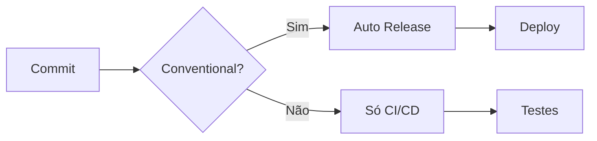

# 🚀 Guia de Conventional Commits e Releases Automáticas

Este projeto usa **Conventional Commits** para gerar releases automaticamente!

## 📝 Formato dos Commits

```
<type>(<scope>): <description>

[optional body]

[optional footer(s)]
```

## 🏷️ Tipos de Commits e Versionamento

| Tipo | Descrição | Exemplo | Versão |
|------|-----------|---------|--------|
| `feat` | Nova funcionalidade | `feat: adicionar endpoint de busca` | **MINOR** ⬆️ |
| `fix` | Correção de bug | `fix: corrigir validação de email` | **PATCH** ⬆️ |
| `docs` | Documentação | `docs: atualizar README` | Sem release |
| `style` | Formatação | `style: corrigir indentação` | Sem release |
| `refactor` | Refatoração | `refactor: melhorar performance` | Sem release |
| `test` | Testes | `test: adicionar testes unitários` | Sem release |
| `chore` | Manutenção | `chore: atualizar dependências` | Sem release |
| `BREAKING CHANGE` | Mudança que quebra compatibilidade | Ver exemplo abaixo | **MAJOR** ⬆️ |

## 🎯 Exemplos Práticos

### ✨ Nova Funcionalidade (MINOR)
```bash
git commit -m "feat(user): adicionar endpoint de busca por email

Implementa busca de usuários por email com paginação
e validação de formato de email."
```

### 🐛 Correção de Bug (PATCH)
```bash
git commit -m "fix(validation): corrigir validação de CPF

Resolve problema onde CPFs com zeros à esquerda
não eram validados corretamente."
```

### 💥 Breaking Change (MAJOR)
```bash
git commit -m "feat(api): alterar formato de resposta

BREAKING CHANGE: O endpoint /users agora retorna
um objeto com metadata ao invés de array simples.

Antes: [{"id": 1, "name": "João"}]
Depois: {"data": [{"id": 1, "name": "João"}], "total": 1}"
```

### 🔧 Múltiplas Mudanças
```bash
git commit -m "feat(user): adicionar validação avançada

- Validação de força de senha
- Verificação de email único
- Sanitização de inputs

Closes #123"
```

## 🚀 Como Funciona o Release Automático

1. **Push na main** → Workflow analisa commits
2. **Conventional Commits detectados** → Calcula nova versão
3. **Release criada automaticamente** → Com changelog gerado
4. **Pipeline de publish executada** → Deploy automático

## 📊 Fluxo de Trabalho



## 🎨 Scopes Sugeridos

- `user` - Funcionalidades de usuário
- `api` - Endpoints da API
- `validation` - Validações
- `database` - Banco de dados
- `config` - Configurações
- `security` - Segurança
- `docs` - Documentação

## 💡 Dicas

### ✅ Boas Práticas
- Use **scopes** para organizar
- Seja **descritivo** no título
- Adicione **body** para contexto
- Use **BREAKING CHANGE** quando necessário

### ❌ Evitar
- `fix bug` (muito genérico)
- `update code` (sem contexto)
- `wip` (work in progress)
- Commits sem tipo

## 🔄 Exemplo de Desenvolvimento

```bash
# Desenvolvimento de feature
git commit -m "feat(user): implementar CRUD básico"

# Testes
git commit -m "test(user): adicionar testes unitários"

# Documentação
git commit -m "docs(api): documentar endpoints de usuário"

# Correção
git commit -m "fix(user): corrigir validação de idade"

# Push na main → Release v1.1.0 criada automaticamente!
git push origin main
```

## 📈 Vantagens

- 🤖 **Releases automáticas**
- 📝 **Changelog gerado**
- 🏷️ **Versionamento semântico**
- 🔍 **Histórico organizado**
- 🚀 **Deploy automático**

---
